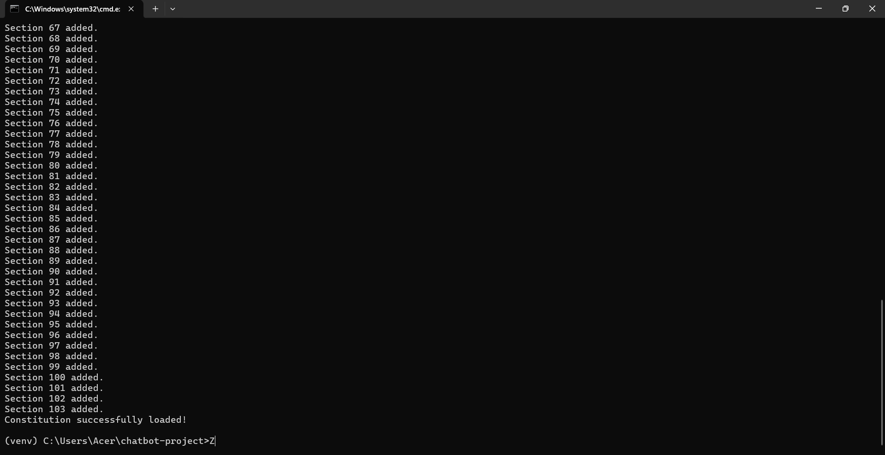
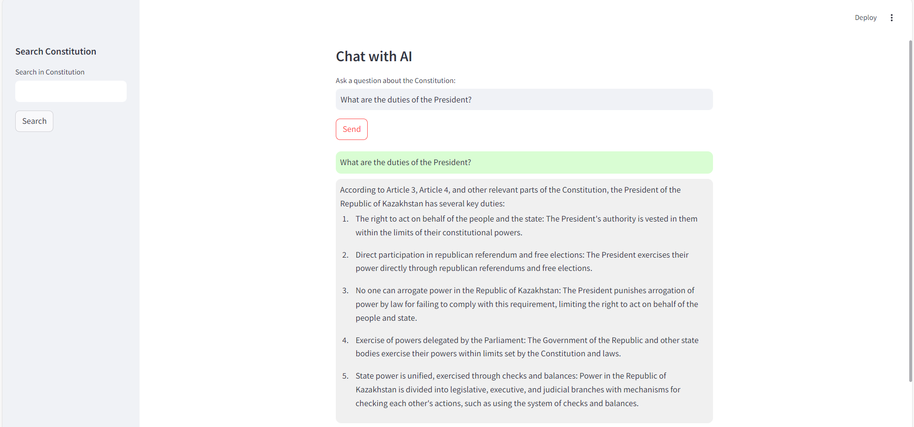
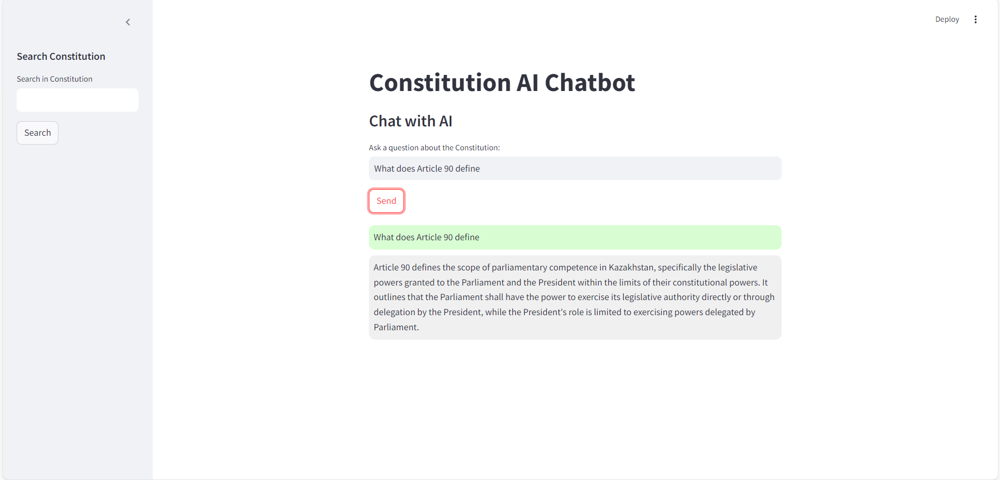
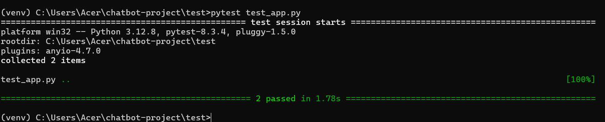

# Constitution AI Assistant - (✿◡‿◡) 

---

### **Title**
**Constitution AI Chatbot**  
An intelligent assistant designed to answer all questions related to the Constitution of the Republic of Kazakhstan. This application uses advanced language models to provide accurate responses based on the Constitution's content, citing specific articles and sections where applicable.

---

### **Installation**

#### **1. Clone the Repository**
Clone the repository to your local system:
```bash
git clone <repository_url>
cd chatbot-project
```

#### **2. Set Up a Virtual Environment**
Create and activate a virtual environment:
```bash
# For Windows
python -m venv venv
venv\\Scripts\\activate

# For macOS/Linux
python3 -m venv venv
source venv/bin/activate
```

#### **3. Install Dependencies**
Install all required Python packages:
```bash
pip install -r requirements.txt
```

#### **4. Start MongoDB**
Ensure MongoDB is installed and running on `localhost:27017`. Use the following command to start MongoDB:
```bash
mongod --dbpath=<path_to_db_directory>
```

---

### **Usage**

#### **1. Load the Constitution**
Before running the chatbot, ensure the Constitution is loaded into the database. Run the following script:
```bash
python load_constitution.py
```


This script will:
- Parse the `constitution.txt` file.
- Split the content into sections or articles.
- Generate embeddings for each section using the `ollama` model.
- Save the sections and embeddings into MongoDB.

#### **2. Run the Chatbot**
Launch the chatbot using Streamlit:
```bash
streamlit run app.py
```

#### **3. Interact with the Chatbot**
- Use the **Chat** interface to ask questions like:
  - *"What does Article 4 state?"*
  - *"What are the rights of citizens?"*
- Use the **Search Constitution** feature to search for keywords or phrases directly in the Constitution.

---

### **Examples**

#### **Question: "What are the duties of the President?"**
**Response:**
*"Based on Article 40, the President of Kazakhstan ensures the unity of the nation and coordinates all state powers."*



#### **Question: "What does Article 90 define?"**
**Response:**
*"Article 1 states that the Republic of Kazakhstan is a democratic, secular, and social state prioritizing individual rights and freedoms."*


---

### **Test**

#### **Unit Tests**
The project includes a `test_app.py` file to test core functionalities.

##### **Run Tests**
Use the following command to execute all tests:
```bash
pytest test_app.py
```


##### **Tested Features**
1. **Embedding Generation**:
   - Verifies the embedding output for given text.
2. **File Processing**:
   - Ensures that files are correctly parsed and added to the database.
3. **Chatbot Queries**:
   - Tests the chatbot's ability to retrieve and process relevant sections from the Constitution.

